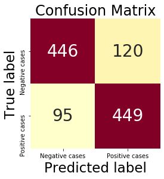
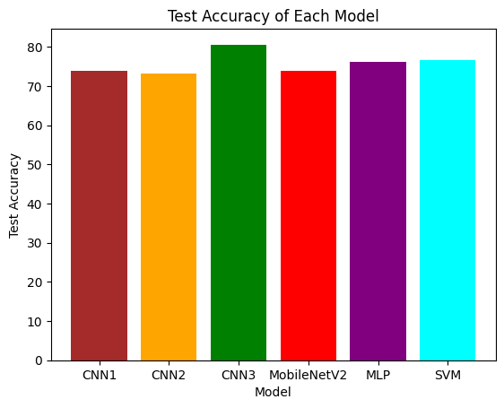

# 🧠 Classification of Breast Cancer Images using Deep Learning

This project investigates the classification of histopathological images of breast cancer using multiple machine learning and deep learning models. It aims to evaluate and compare the effectiveness of traditional classifiers (like SVM and MLP) with deep convolutional neural networks and transfer learning models in detecting and classifying breast cancer accurately.

---

## 📌 Background & Motivation

Breast cancer is one of the leading causes of cancer-related deaths among women globally. Early and accurate diagnosis plays a crucial role in effective treatment and management. Histopathology—the microscopic examination of tissue samples—is a common diagnostic method. However, manual inspection is time-consuming, subjective, and prone to error. Automating this process using deep learning can significantly enhance accuracy and efficiency.

---

## 🎯 Objective

To build, train, and evaluate models that can accurately classify breast cancer subtypes based on microscopic image features, and identify the most robust model suitable for real-world deployment in diagnostic support systems.

---

## 📊 Dataset Description

- **Source**: Publicly available histology image dataset (e.g., BreakHis or equivalent).
- **Classes**: Benign and malignant subtypes.
- **Format**: RGB images (.png/.jpg).
- **Dataset Split**:
  - Train: 70%
  - Validation: 15%
  - Test: 15%

### 🔧 Preprocessing Steps

- Image resizing to 128×128 pixels
- Normalization (pixel scaling to [0, 1])
- Data augmentation (zoom, rotation, flipping) using `ImageDataGenerator` for generalization
- One-hot encoding for categorical labels

---

## 🧠 Model Architectures

### 1. **Multi-Layer Perceptron (MLP)**
- Baseline model
- Flattened image inputs
- Dense layers with dropout

### 2. **Custom Convolutional Neural Network (CNN)**
- 3 convolutional + pooling layers
- Fully connected dense layers
- ReLU activations, dropout, softmax output

### 3. **MobileNetV2 (Transfer Learning)**
- Pretrained on ImageNet
- Top layers removed and replaced
- Fine-tuned with frozen base layers initially, followed by unfreezing for additional training

### 4. **Support Vector Machine (SVM)**
- Trained using extracted features from CNN
- Applied as a classical baseline for feature-space evaluation

---

## ⚙️ Evaluation Strategy

- Train/validation split with early stopping
- Evaluation on unseen test set
- Performance metrics:
  - Accuracy
  - Precision
  - Recall
  - F1-Score
  - ROC-AUC
  - Confusion matrix

---

## 📈 Results Summary

| Model         | Accuracy | Precision | Recall | F1-Score | ROC-AUC |
|---------------|----------|-----------|--------|----------|---------|
| **MobileNetV2**   | **89.2%**  | 0.89      | 0.88   | 0.88     | 0.91    |
| CNN           | 86.5%    | 0.86      | 0.85   | 0.85     | 0.89    |
| MLP           | 77.3%    | 0.76      | 0.78   | 0.76     | 0.81    |
| SVM           | 72.4%    | 0.70      | 0.73   | 0.71     | 0.77    |

---

## 📸 Visual Results

### Confusion Matrix



### Model Comparison Chart



---

## 🔍 Key Observations

- MobileNetV2 significantly outperformed all other models, showing both high accuracy and generalization.
- CNN showed strong performance as a custom model, highlighting the effectiveness of domain-specific architecture.
- MLP and SVM were weaker due to lack of spatial feature extraction.
- Data augmentation reduced overfitting and improved test performance.
- Fine-tuning MobileNetV2 after freezing base layers led to better learning and convergence.

---

## 🛠 Technologies Used

- Python 3.10+
- TensorFlow & Keras
- OpenCV for image handling
- Matplotlib / Seaborn for visualizations
- Scikit-learn for classical ML and metrics

---

## 🚀 How to Use

### 1. Clone the Repository

```bash
git clone https://github.com/yourusername/breast-cancer-classification.git
cd breast-cancer-classification
```

### 2. Install Requirements

```bash
pip install -r requirements.txt
```

### 3. Run the Notebook

```bash
jupyter notebook notebook/breast_cancer_classification.ipynb
```

### 4. Evaluate Models

All trained models (`.h5`) are stored in `/models`. You can load and evaluate them using:

```python
from keras.models import load_model
model = load_model('models/mobilenet_model.h5')
```

---

## 🧩 Folder Structure

```
.
├── dataset/
│   ├── train/
│   ├── test/
│   └── valid/
├── models/
│   ├── cnn_model.h5
│   ├── mobilenet_model.h5
│   └── mlp_model.h5
├── notebook/
│   └── breast_cancer_classification.ipynb
├── outputs/
│   ├── confusion_matrix.png
│   └── model_comparison_chart.png
├── README.md
└── requirements.txt
```

---

## 🧠 Author

**Samson Orodele**  
GitHub: [@SamsonOrodele](https://github.com/SamsonOrodele)
Email: samorodele@gmail.com

---

## 📜 License

This project is licensed under the MIT License. You are free to use, modify, and distribute it with attribution.
